# NO₂ Forecasting — Graphs & Visualizations Guide

This document explains every graph produced across notebooks 01–03, what each one
shows, and **why it matters for predicting NO₂**. The three notebooks form a
deliberate pipeline: explore the raw data → understand the temporal structure →
diagnose the trained models.

---

## The Big Picture: How the Notebooks Connect

```
Notebook 01  →  Notebook 02  →  Notebook 03
(Data Quality   (Temporal        (Model
 & Spatial       Structure)       Diagnostics)
 Exploration)
     ↓               ↓               ↓
 Know WHAT        Know WHEN       Know WHERE
 data you have    patterns exist  the model fails
```

A forecasting model trained on data it does not understand will not generalise.
Notebooks 01 and 02 build that understanding. Notebook 03 then checks whether the
trained model has actually captured what the EDA revealed.

---

## File Location Convention

Images in this project are saved to two directories:

| Directory | Contents |
|---|---|
| `outputs/` | EDA figures from Notebook 01 (`eda_*.png`) and model comparison figures from `compare.py` (`comparison_*.png`, `site_mae_map.png`) |
| `plots/` | Extended time-series figures from Notebook 02 (`ts_*.png`, `monthly_boxplot.png`) and model diagnostic figures from Notebook 03 (`diag_*.png`) |

Both directories are tracked in git. Only `.pt` checkpoint files are excluded.

---

## Notebook 01 — `01_explore_airnow.ipynb`
### Exploratory Data Analysis

This notebook answers the most fundamental questions before any model is touched:
*Is the data usable? Where are the sensors? What does a typical day look like?*

---

### 1. Missing Data Heatmap
**File:** `outputs/eda_missing_data_heatmap.png`

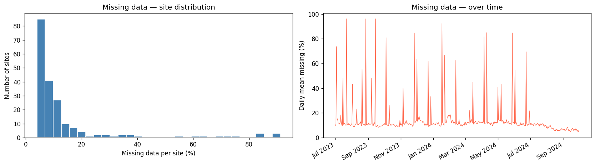

Two side-by-side panels that together characterise data reliability across the network.

**Left panel — Site-level missing data distribution (histogram)**
Each bar shows how many monitoring stations are missing a certain percentage of
their hourly readings. A histogram skewed to the left (most bars near 0 %) means
the network is largely reliable. A long right tail means a handful of stations are
very sparse and may need to be excluded or imputed.

**Right panel — Network-wide daily missing rate (line chart)**
The line traces the percentage of stations that had a missing reading on each day.
A flat low line means data loss is random and independent across stations. Spikes
mean many stations went offline simultaneously — possibly a regional storm, a
scheduled agency-wide maintenance window, or a data collection outage.

**Why it matters for forecasting:**
Missing data directly affects training quality. A 24-hour look-back window that
contains gaps will produce noisy input sequences. The heatmap identifies which
time periods are safe to include in training and flags whether any stations should
be dropped entirely. An overall missing rate of ~13.7 % across all station-hour
pairs — computed as the fraction of NaN entries in the full sites × time matrix,
before any station filtering — informed the decision to impute short gaps
(≤ 3 hours) with linear interpolation rather than discard those windows.

---

### 2. Site Map
**File:** `outputs/eda_site_map.png`

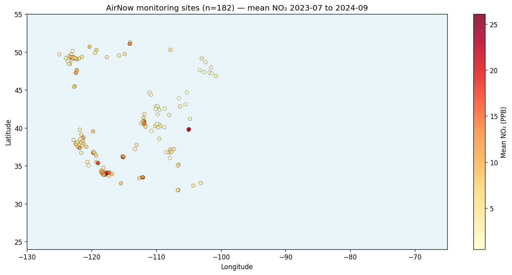

A scatter plot of all ~197 monitoring stations on a US map. Each dot is one
station, positioned at its actual latitude/longitude. Dot colour encodes the
station's time-averaged NO₂ concentration (yellow = low, orange/red = high).

**What it shows:**
- Spatial coverage: which parts of the country have sensors and which do not.
- Urban vs rural contrast: red/orange dots are consistent with urban and
  industrial areas (e.g. Seattle, Portland, Denver) where traffic and industry
  are major emission sources; yellow dots sit in rural and coastal areas.
- Network density: the western coverage is sparser than the east — this affects
  how well a spatially-aggregated forecast generalises.

**Why it matters for forecasting:**
A model trained across 197 spatially diverse stations must handle a huge range of
baseline concentrations. Sites near highways routinely read 30–40 PPB while rural
sites average under 5 PPB. Without normalising per-station (dividing each series
by its training-set mean), the model would be dominated by a few high-NO₂ urban
sites. The site map provides visual intuition for this normalisation choice and
also anchors the per-site error maps produced in Notebook 03.

---

### 3. NO₂ Time Series: Representative Sites
**File:** `outputs/eda_no2_time_series.png`

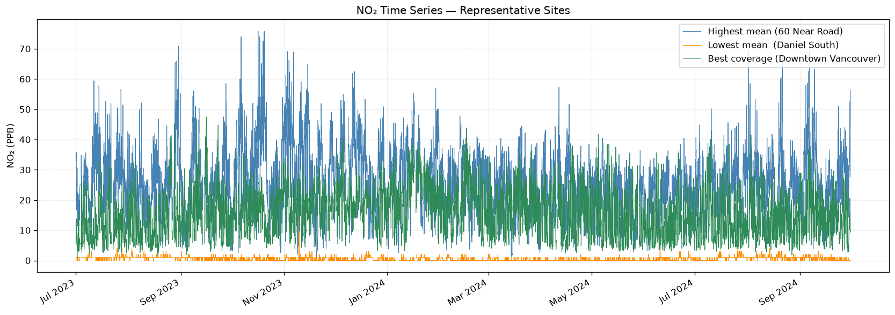

Three stacked line charts, each covering the full 15-month dataset (July 2023 –
September 2024) at hourly resolution. Three stations are selected automatically
by the following criteria:

- **Top panel** — highest mean NO₂ across the dataset (likely a busy urban or
  highway-adjacent site). Shows large-amplitude diurnal swings and occasional
  extreme spikes.
- **Middle panel** — lowest mean NO₂ across the dataset (likely a rural or
  coastal location). Shows the same seasonal shape but much smaller amplitude.
- **Bottom panel** — highest data coverage (fewest missing readings). Shows
  what a clean, gap-free input sequence looks like.

**Why it matters for forecasting:**
One of the most important sanity checks before training. It confirms that
the hourly temporal structure is intact, that the seasonal shape is visible, and
that gaps appear as flat stretches (not as zeroes or artefacts that would silently
corrupt training sequences). It also illustrates the dynamic range the model must
handle across stations.

---

### 4. Diurnal Cycle
**File:** `outputs/eda_diurnal_cycle.png`

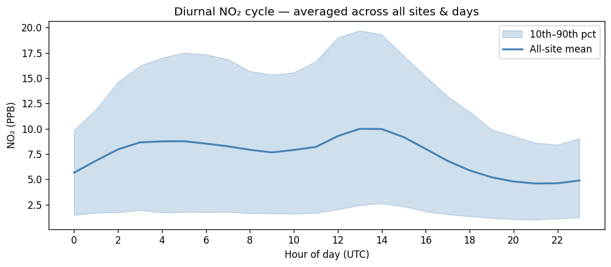

A single line chart where the X-axis is hour of day (UTC, 0–23) and the Y-axis
is mean NO₂ in PPB. The solid blue line is the grand average over all stations
and all days. The shaded light-blue band shows the 10th–90th percentile spread
across stations.

**What it shows:**
The characteristic two-peak daily rhythm:
- Morning peak at UTC hours consistent with local rush hour across the network's
  time zones (the exact UTC offset varies by station location and by daylight
  saving time, so no single local-time translation applies to all sites).
- Afternoon dip as UV sunlight photo-dissociates NO₂ into NO and O.
- Slight evening rise from the evening commute.
- Overnight minimum when traffic is lowest.

The wide shaded band at the morning peak shows that urban sites spike far more
than rural ones during rush hour.

**Why it matters for forecasting:**
This is the *dominant signal* the model must learn. A 24-hour look-back window
captures at least one full diurnal cycle. The model that does not reproduce this
shape has fundamentally failed. The Notebook 03 attention-weight heatmap (Section
4.2 below) directly reveals whether the Transformer has learned to focus on the
corresponding hour from the previous cycle.

---

### 5. Monthly Seasonal Pattern (Box Plot)
**File:** `plots/monthly_boxplot.png`

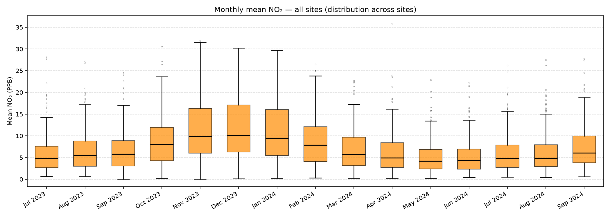

A box-and-whisker plot with one box per calendar month. Each box summarises the
distribution of station-level monthly means — each station contributes one value
per month (its mean NO₂ for that month) — across all monitoring stations:
- Centre line = median of station-level monthly means.
- Box = interquartile range (IQR) across stations.
- Whiskers = 1.5 × IQR.
- Dots beyond whiskers = outlier stations for that month.

**What it shows:**
The seasonal rhythm: winter months (Dec–Feb) have higher medians because solar UV
is weaker, the atmosphere is more stable (less vertical mixing), and home heating
adds emissions. Summer months are lower on average but often show a wider spread,
which may reflect events such as wildfires inflating certain sites.

**Why it matters for forecasting:**
Month-of-year is one of the strongest predictors of ambient NO₂. The seasonal
pattern here validates that the 15-month training window captures a full seasonal
cycle (crucial for the model to learn winter vs summer behaviour) and sets
expectations for which months will be harder to forecast accurately.

---

### 6. Daily Mean NO₂: All Sites
**File:** `outputs/eda_daily_mean_all_sites.png`

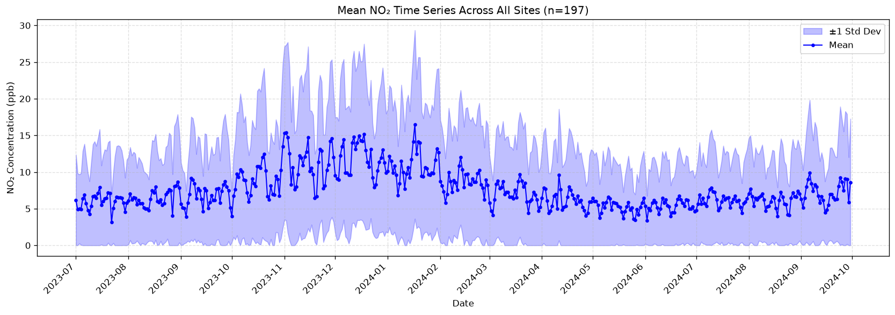

A line chart showing the network-wide daily mean NO₂ (average across all sites,
then resampled to daily resolution). The blue line is the daily mean; the shaded
region shows ±1 standard deviation across sites on that day.

**What it shows:**
The full 15-month trend at a glance. Wide shaded bands indicate days with high
spatial variance (e.g. wildfire events affecting only certain regions). Narrow
bands indicate homogeneous days where all sites behaved similarly.

**Why it matters for forecasting:**
Anomalous events visible here (sudden spikes, prolonged elevated periods) are the
hardest cases for the model. If the model sees this chart and cannot explain a
spike, it is likely missing a feature (wildfire smoke, regional inversions). This
baseline also provides the denominator intuition for the normalised MAE metric
used in model evaluation.

---

### 7. Daily Mean NO₂: Single Site
**File:** `outputs/eda_daily_mean_site.png`

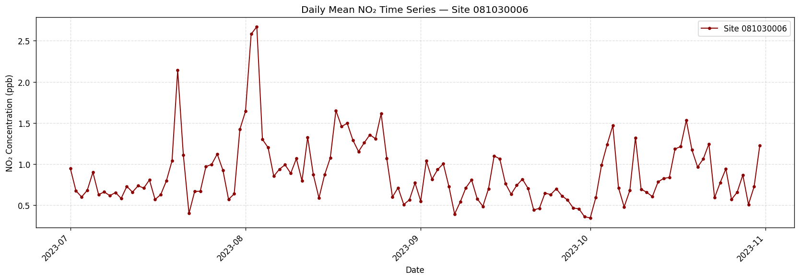

The same daily-mean chart as above, but focused on a single station (`081030006`).
There is no shaded band — this is a single sensor's actual record.

**Why it matters for forecasting:**
Comparing this to the network-wide chart shows whether the site is a "typical"
station or an outlier. A site that deviates strongly from the network trend
(local sources, unusual geography) will be harder for a cross-site model to
forecast and will show up as a red dot on the per-site MAE map in Notebook 03.

---

## Notebook 02 — `02_no2_time_series.ipynb`
### Extended Time Series Analysis

Notebook 02 goes deeper into the temporal structure: *How do different regions
behave? Does the diurnal shape change by season? What counts as an anomaly?*
These questions directly inform what the model must generalise across.

---

### 1. Top-N Highest-NO₂ Sites
**File:** `plots/ts_top_sites.png`

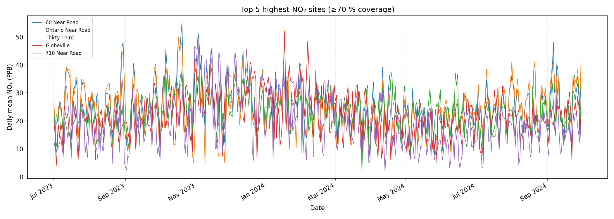

Daily-mean time series for the five stations with the highest average NO₂
concentration (filtered to stations with ≥ 70 % data coverage to ensure complete
traces). Each station is a separate coloured line.

**Legend format:** Each entry shows `Station Name  [AQS_code  lat°N, lon°W]`,
for example `60 Near Road  [060710027  34.03°N, 117.62°W]`. This makes it easy
to look up any station on a map or cross-reference it with the README's site
table. See the [README AQS site codes section](../README.md) for plain-English
descriptions of the near-road and Globeville sites that commonly appear here.

**What it shows:**
The diversity of behaviour among high-pollution sites. Some follow a smooth
seasonal arc; others have sharp spikes from industrial events. Lines that diverge
from each other reveal that pollution is locally driven, not just weather-driven.
The highest-ranking sites are typically near-road monitors (e.g. "60 Near Road",
"710 Near Road") or urban environmental-justice neighbourhoods (e.g.
"Globeville", Denver) — all locations where vehicle exhaust and industrial
emissions are concentrated.

**Why it matters for forecasting:**
The per-station normalisation is validated here: if one site averages 40 PPB and
another averages 4 PPB, a raw model would optimise almost entirely for the high
site. These plots confirm which sites dominate the raw error and justify the
per-site mean normalisation applied before training.

---

### 2. Regional Time Series — West / Central / East
**File:** `plots/ts_regional.png`

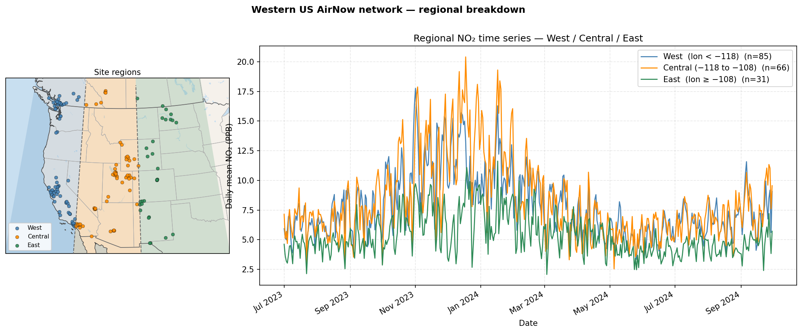

Three smoothed lines (daily mean resampled to daily, then plotted) showing the
average NO₂ trajectory for stations in three geographic bands. The dataset covers
roughly −128 ° to −100 ° longitude (Pacific NW to the Great Plains), so the
boundaries are split into thirds of that range:
- **West** (longitude < −118 °): Pacific coast + Sierra Nevada / Cascades (n ≈ 85)
- **Central** (−118 ° to −108 °): Intermountain / Rockies (n ≈ 66)
- **East** (longitude ≥ −108 °): Great Plains + eastern edge of coverage (n ≈ 31)

**What it shows:**
Regional synchrony and divergence. When all three lines move together, a
continental-scale forcing is responsible (e.g. a cold-air mass). When they
diverge, local emissions or weather patterns dominate.

**Why it matters for forecasting:**
The model is trained on all stations simultaneously. If regions are structurally
different, the model needs enough capacity to represent those differences.
Pronounced regional divergence here would argue for separate models per region
or explicit geographic embeddings. It also helps explain spatial patterns in the
per-site MAE map (Notebook 03).

---

### 3. Seasonal Diurnal Overlay
**File:** `plots/ts_seasonal_overlay.png`

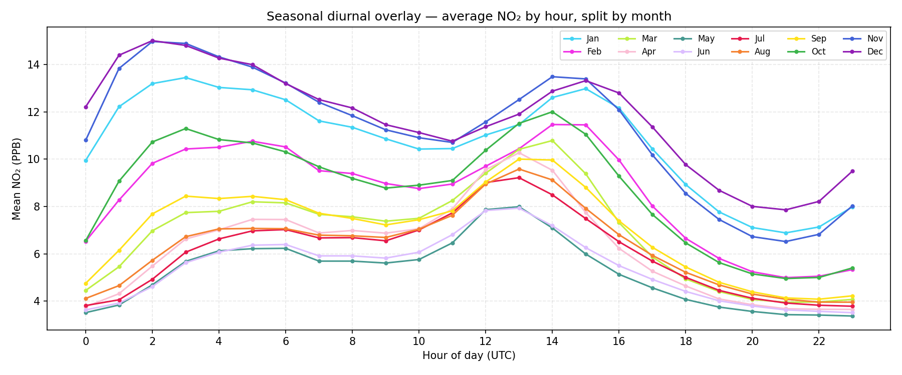

Twelve lines on a single chart, one per calendar month, each showing the average
diurnal profile (mean NO₂ by hour of day) for that month. The X-axis is hour
(0–23 UTC) and the Y-axis is mean PPB. Each line is distinctly coloured.

**What it shows:**
How the shape and amplitude of the daily cycle shifts through the year. Winter
months (blues/purples) sit higher overall and may show a more pronounced morning
peak. Summer months (reds/oranges) are lower and flatter. The hour at which the
daily peak occurs may shift slightly with the solar zenith angle.

**Why it matters for forecasting:**
This is the most information-dense plot in the EDA pipeline. It confirms that the
model's look-back window (24 hours) covers a meaningful portion of the diurnal
cycle *in every season*. It also reveals that no single diurnal template
generalises across all months — the model must implicitly learn the seasonal
modulation of the diurnal shape from the training data.

---

### 4. Rolling Average / Smoothed Trends
**File:** `plots/ts_rolling_avg.png`

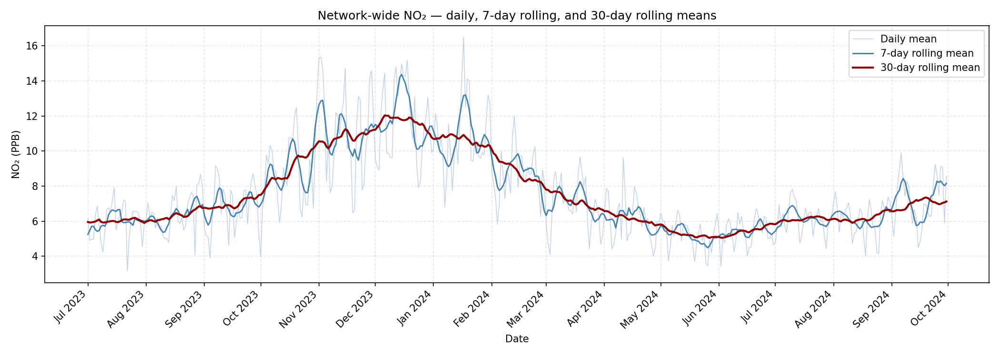

Three overlaid series on a single plot:
- **Light grey line** — raw daily mean NO₂ (noisy).
- **Blue line** — 7-day centred rolling mean (weekly smoothing).
- **Dark red line** — 30-day centred rolling mean (monthly smoothing).

**What it shows:**
The hierarchical time scales in NO₂ variability. The 30-day line extracts the
seasonal arc cleanly. The 7-day line preserves week-to-week variation (e.g.
weekday vs weekend effects, short pollution events). The raw daily line retains
all noise.

**Why it matters for forecasting:**
The 6-hour forecast horizon sits well below the weekly scale. Knowing that
week-to-week variability is substantial tells us that the 24-hour look-back window
captures most of the relevant short-term context. Residual patterns that persist
at the 7-day scale but are not captured by the model will appear as autocorrelated
residuals in the Notebook 03 ACF plots.

---

### 5. Anomaly Bar Chart
**File:** `plots/ts_anomaly.png`

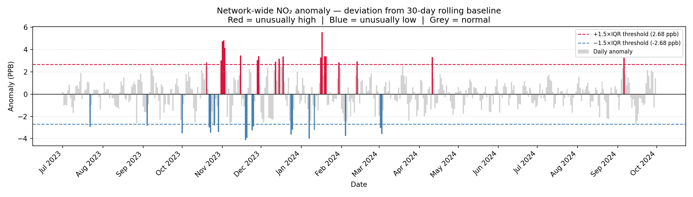

A bar chart where each bar represents one day. Bar height = daily mean NO₂ minus
the 30-day rolling baseline (the "anomaly"). Bars coloured:
- **Crimson** — unusually high days (anomaly > +1.5 × IQR).
- **Steel blue** — unusually low days (anomaly < −1.5 × IQR).
- **Light grey** — normal days.

Dashed red and blue horizontal lines mark the threshold levels.

**What it shows:**
The timing, frequency, and magnitude of pollution events (crimson) and
unusually clean periods (blue). Clustered crimson bars may correspond to events
such as wildfires or temperature inversions; clusters of blue bars may reflect
conditions such as storms that flush pollutants away.

**Why it matters for forecasting:**
Anomalous days are the hardest test cases. A model that performs well on average
but completely misses anomaly spikes is not useful for air quality alerts. This
chart shows how many such events exist in the test period and provides a benchmark
for subjectively assessing the forecast quality on extreme days.

---

### 6. Anomaly Detection Overlay
**File:** `plots/ts_anomaly_overlay.png`

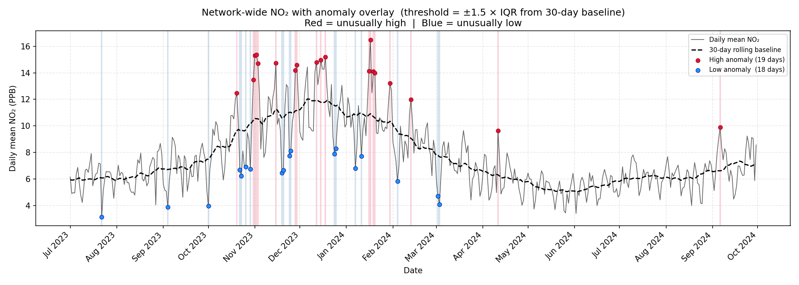

The same daily time series as the network-wide chart from Notebook 01, but with
event markers and background shading added:
- **Red vertical shading + crimson dots** — high-anomaly days.
- **Blue vertical shading + blue dots** — low-anomaly days.
- **Black dashed line** — 30-day rolling baseline.

**What it shows:**
Exactly when and how often the network deviated from its rolling trend. This is
the clearest single view of "interesting" days in the dataset.

**Why it matters for forecasting:**
Aligning these anomalous dates with calendar events (wildfire records, weather
archives) can reveal causal drivers that are not captured in the NO₂ signal alone.
It also defines the hardest portion of the test set — if the final evaluation
window (Sep 2024) contains multiple anomalous days, the test MSE will be
inflated relative to a typical period.

---

## Notebook 03 — `03_model_diagnostics.ipynb`
### Model Diagnostics

The first two notebooks described the data. Notebook 03 evaluates how well the
trained models have *learned* that structure. Each plot here is a direct
interrogation of the model's behaviour on held-out test data.

---

### 1. Forecast Error Time Decomposition
**File:** `plots/diag_error_decomp.png`

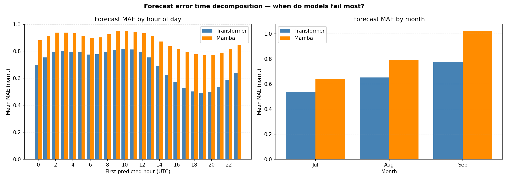

Two grouped bar charts side by side, with Transformer (blue) and Mamba (orange)
bars in each:

**Left panel — MAE by first predicted hour (UTC)**
The X-axis is the UTC hour of the first predicted timestep (= the input window
start timestamp + `SEQ_LEN` hours, i.e. the first hour the model is actually
forecasting). The Y-axis is mean absolute error in normalised units. Each bar
shows the average error for all test windows whose first predicted hour falls at
that UTC hour.

**Right panel — MAE by month of year**
The X-axis is calendar month (from the test set). Each bar shows the average
error for forecasts that begin in that month.

**What it shows:**
*When* each model makes its largest errors. A spike at a particular hour means
the model systematically struggles at transitions (e.g. the pre-dawn ramp-up or
the afternoon dip). A spike in a particular month means the model has not fully
generalised to that season.

**Why it matters for forecasting:**
Combined with the diurnal cycle chart (Notebook 01) and the seasonal overlay
(Notebook 02), this is the critical feedback loop. If the model error peaks at
the morning rush-hour hours that Notebook 01 identified as having the widest
inter-station spread, it confirms that high spatial variability at those hours is
the root cause. If winter months show higher MAE, it aligns with the seasonal
boxplot showing more extreme and variable winter concentrations. This
decomposition tells you whether model improvements should target temporal
capacity, seasonal coverage, or spatial diversity.

---

### 2. Attention Weight Heatmap
**File:** `plots/diag_attention_weights.png`

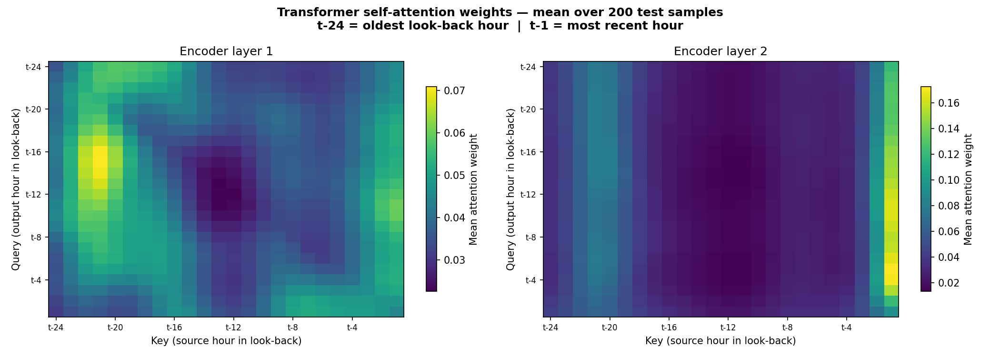

One heatmap per Transformer encoder layer (2 layers by default), each panel
showing a 24 × 24 grid. Rows are query positions (which output time step is
"looking"), columns are key positions (which input time step is "being attended
to"). Colour encodes attention weight (dark = low, bright yellow/green = high).
Averaged over 200 randomly-selected test-set windows.

**What it shows:**
Which past hours the Transformer considers most informative when making each
forecast. Patterns to look for:

- **Bright diagonal** — the model mostly attends to the same relative lag
  (short-range, local context).
- **Bright right-hand columns** — the most recent hours dominate regardless of
  query position (recency bias).
- **Bright columns at lag 24 (t − 24)** — the model is attending to the same
  hour yesterday, indicating it has learned the diurnal cycle.
- **Diffuse, uniform weights** — the model is not specialising; each position
  attends broadly (possible underfitting).

**Why it matters for forecasting:**
This is a "glass-box" inspection of what the Transformer actually learned. The
diurnal cycle chart (Notebook 01) showed that NO₂ peaks at roughly the same hours
each day. If the attention weights show a bright column at t − 24, the model has
successfully internalised this. If it does not, the model is predicting the daily
pattern from something else (e.g. overall level) and is likely to fail when that
daily pattern shifts (unusual events, season transitions).

---

### 3. Residual Autocorrelation — ACF & PACF
**File:** `plots/diag_residual_acf.png`

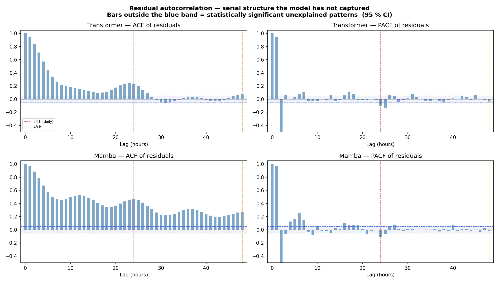

A 2 × 2 grid of autocorrelation plots:

| | Transformer | Mamba |
|---|---|---|
| **ACF** | Top-left | Bottom-left |
| **PACF** | Top-right | Bottom-right |

Each plot shows autocorrelation (ACF) or partial autocorrelation (PACF) of the
per-window mean signed error — (predicted − actual) averaged over the 6 forecast
steps and all ~197 sites, yielding one scalar per test window — at lags 0–48 hours. The blue shaded band is the 95 % confidence interval
under the null hypothesis of white noise. Spikes outside this band indicate
statistically significant serial correlation.

- **ACF** — total correlation between a residual and the residual *k* hours later.
- **PACF** — direct correlation at lag *k* after removing the effect of shorter lags.
- **Lag 24 (red dashed line)** — corresponds to the diurnal cycle (one day).
- **Lag 48 (orange dashed line)** — two days.

**What it shows:**
Whether the model has left systematic temporal patterns unexplained. A clean model
produces residuals that look like white noise — no spikes outside the confidence
band. Real forecasting models almost always have some residual structure.

- Spike at lag 1: the model's errors are correlated hour-to-hour (it missed a
  short-term trend).
- Spike at lag 24: the model has not fully captured the diurnal cycle (the same
  error repeats at the same time each day).
- Spikes at lags 1–6: the model under-responds to recent changes.

**Why it matters for forecasting:**
The rolling average plots (Notebook 02) showed structure at 7-day and 30-day
scales. The anomaly plot showed episodic events. If the ACF shows residual
correlation at lag 24, it means the model is not capturing the diurnal rhythm
that Notebook 01 clearly identified — a direct diagnosis connecting EDA to
model performance. Any significant structure in the ACF/PACF represents
"free performance" left on the table: adding a direct lag-24 feature or
increasing the look-back window could eliminate it.

---

## Model Comparison Plots (produced by `compare.py`)

These plots summarise the final model comparison step. After training both models,
run `python compare.py` from the project root to generate them. All outputs are
saved to `outputs/`, independent of the notebooks.

---

### Training & Validation Loss Curves
**File:** `outputs/comparison_curves.png`

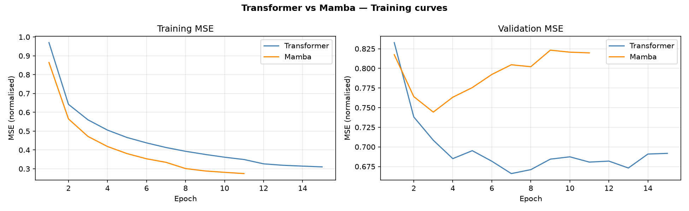

Two panels (one per model) showing training and validation MSE vs epoch. The key
signal is whether validation loss converges smoothly or diverges from training
loss (overfitting). Learning-rate reduction events appear as sudden downward kinks.
Early stopping saves the best checkpoint before validation loss degrades.

---

### Predicted vs Actual Scatter
**File:** `outputs/comparison_scatter.png`

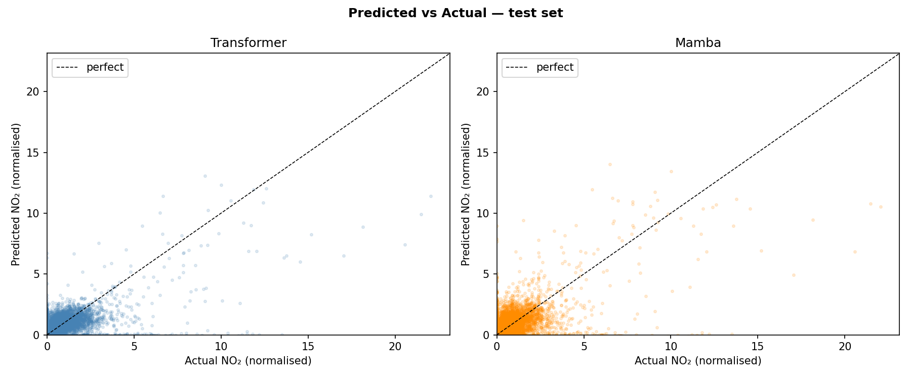

5,000 randomly-sampled (actual, predicted) pairs from the test set, one scatter
plot per model. Perfect predictions lie on the dashed diagonal. The tightness and
symmetry of the point cloud around this line summarises overall model accuracy.
A fan shape (wider at high values) means the model struggles with extreme
concentrations — exactly the anomaly events identified in Notebooks 01 and 02.

---

### Per-Site MAE Map
**File:** `outputs/site_mae_map.png`

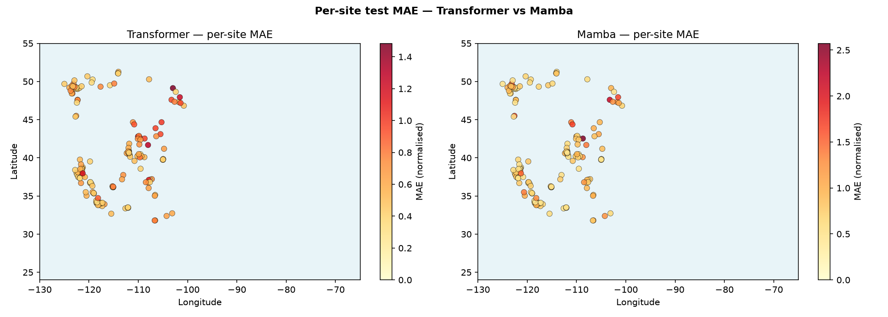

The monitoring stations from the site map (Notebook 01) re-plotted with dot colour
now encoding each station's individual test-set MAE (yellow = accurate, red = high
error). This map closes the loop between spatial understanding (Notebook 01) and
model performance: stations that appeared as red outliers on the mean-NO₂ map
tend to also appear as red outliers on the MAE map, confirming that high
local variability is the main driver of forecast difficulty.

---

## Summary: How Each Graph Feeds the Prediction Pipeline

| Graph | Notebook | What it tells the model |
|---|---|---|
| Missing data heatmap | 01 | Which windows and sites are reliable for training |
| Site map | 01 | Scale of spatial diversity; motivation for per-site normalisation |
| Representative time series | 01 | Confirms temporal structure and data integrity |
| Diurnal cycle | 01 | The primary signal the model must reproduce |
| Monthly boxplot | 01 | Seasonal amplitude the model must generalise across |
| Network daily mean | 01 | Anomaly baseline and test-set difficulty |
| Top-N sites | 02 | Validates that normalisation decouples urban/rural differences |
| Regional trends | 02 | Whether geographic sub-models or embeddings are needed |
| Seasonal diurnal overlay | 02 | Seasonal modulation of the diurnal shape |
| Rolling averages | 02 | Hierarchy of time scales; relevance of 24-hour window |
| Anomaly bar chart | 02 | Event calendar for the hardest forecast cases |
| Anomaly overlay | 02 | Visual identification of event-driven test difficulty |
| Error decomposition | 03 | Which hours/months the model fails and why |
| Attention heatmap | 03 | Confirms whether the diurnal signal is learned |
| Residual ACF/PACF | 03 | Unexplained temporal structure; directions for improvement |
| Loss curves | compare.py | Training health and overfitting detection |
| Predicted vs actual | compare.py | Overall accuracy and handling of extremes |
| Per-site MAE map | compare.py | Spatial pattern of forecast error |
