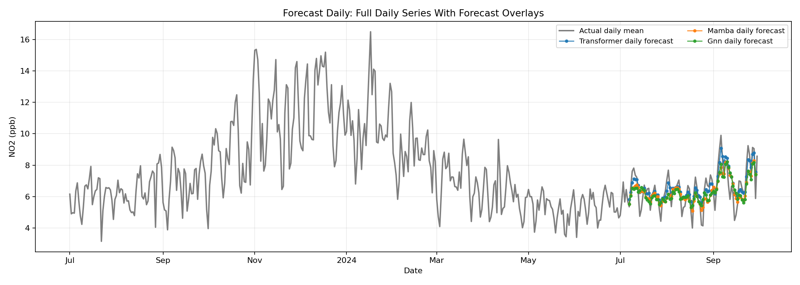
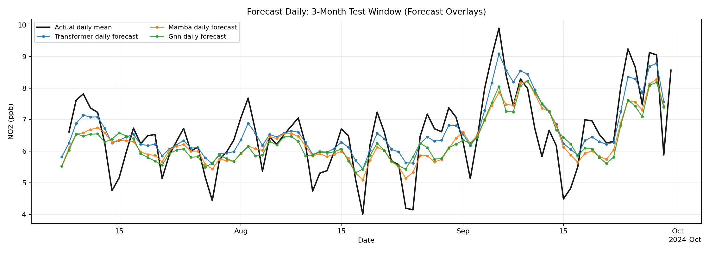

# Forecast Daily Results Guide

This folder stores outputs from daily univariate NO2 forecasting experiments
for three models:
- Transformer
- Mamba-like (GRU stand-in)
- GNN-style temporal model

## Training/Testing Methodology

All results in this folder were produced by running:

```bash
python forecast_daily/generate_results.py --epochs 50 --batch-size 32 --lr 1e-3 --train-end auto
```

Optional anti-lag setting:

```bash
python forecast_daily/generate_results.py --epochs 50 --delta-loss-weight 0.35
```

Optional visual date shift (left-shift prediction curves in plots only):

```bash
python forecast_daily/generate_results.py --epochs 50 --plot-shift-days -1
```

Methodology pipeline:
1. Build one canonical daily NO2 mean series (site-mean values per day).
2. Keep one scalar NO2 value per day as the only model input channel.
3. Build direct one-step daily supervision using lagged daily windows:
   - input window K = 7 past daily rows
   - target horizon H = 1 day ahead (direct t+1)
   - no recursive multi-day rollout
4. Split chronologically with `--train-end auto`:
   - train on first full year from the earliest date
   - test on later dates only
5. Fit min-max scaling on train only and apply to train/test daily NO2 values.
6. Train all models on identical train/test windows and evaluate on the same target dates.
7. Save predictions, metrics, checkpoints, and plots.

Anti-lag note:
- Training uses a small day-to-day slope matching term (`--delta-loss-weight`) so predictions react faster to rises/drops instead of trailing by one day.

Plot-shift note:
- `--plot-shift-days` changes plotted prediction dates only (default `-1` for one-day left shift).
- Reported metrics remain computed on true t+1 target dates from `predictions_*.csv`.

## Model results (this run)

From metrics.csv:

| Model | Epochs | Test MAE (ppb) | Test RMSE (ppb) |
|---|---:|---:|---:|
| Transformer | 50 | 0.800 | 1.018 |
| GNN | 50 | 0.863 | 1.061 |
| Mamba | 50 | 0.883 | 1.077 |

Quick takeaways:
- Transformer has the best MAE and RMSE in this anti-lag run.
- GNN is close behind Transformer on RMSE.
- Mamba is competitive but trails the other two here.

## Graphs and how to interpret them

### 1) Time-series comparison


What this plot is:
- Black line: actual daily NO2 across the full daily train+test timeline.
- Colored lines: each model prediction overlaid with optional visual date shift.

How to interpret:
- Better models follow the black line shape, peaks, and dips.
- If peaks are shifted right, the model has lag.
- If peaks are too low/high, the model under/overestimates amplitude.

What to look for in this run:
- Mamba and GNN generally track observed changes more closely than Transformer.

### 1b) Daily time-series diagnostic



What this plot is:
- Gray line: actual daily mean NO2 across the full daily train+test timeline.
- Colored markers/lines: each model's daily forecast values with optional visual date shift.

How to interpret:
- Forecast points may be intentionally shifted left/right for visualization when `--plot-shift-days` is used.
- No forecast values should appear before the test target window.
- Any visible right-shift or left-shift against daily dates indicates an alignment bug.
- Gaps before the first test target date are expected and confirm correct alignment.

### 1c) Zoomed 3-month test window



What this plot is:
- Black line: actual daily mean NO2 over the test-target 3-month window.
- Colored lines/markers: model forecasts only on valid t+1 target dates.

How to interpret:
- Use this view to inspect short-term alignment, peak capture, and day-to-day error.
- Forecast curves should stay date-aligned with the daily target timeline.

### 2) Scatter (actual vs predicted)


What this plot is:
- One panel per model.
- X-axis: actual NO2.
- Y-axis: predicted NO2.
- Red dashed line: perfect prediction (y = x).

How to interpret:
- Points near the red line indicate accurate predictions.
- Wide spread means higher error variance.
- Systematic points below the line at high actual values indicate peak underprediction.

What to look for in this run:
- GNN and Mamba point clouds are tighter than Transformer overall.

### 3) Metrics bar chart


What this plot is:
- Side-by-side MAE and RMSE bars for each model.

How to interpret:
- Lower MAE = better average day-to-day accuracy.
- Lower RMSE = fewer or smaller large errors.
- If RMSE is much larger than MAE, large outliers are likely present.

What to look for in this run:
- Transformer leads on both MAE and RMSE.
- GNN is second-best on RMSE.
- Mamba is third on both error metrics in this run.

## Key output files

- airnow_no2_daily_mean.csv: Daily series used for training/testing.
- predictions_transformer.csv, predictions_mamba.csv, predictions_gnn.csv: test predictions with dates and actuals.
- metrics.csv and metrics.json: summary metrics and ranking.
- history_*.json: per-epoch train/test curves.
- checkpoints/*.pt: trained model weights.
- plots/timeseries_all_models.png: full-timeline daily actual line with date-aligned prediction overlays.
- plots/daily_timeseries_with_target_aligned_forecasts.png: daily-line diagnostic with target-date forecast markers.
- plots/timeseries_test_3_months.png: zoomed 3-month test-window daily timeline with target-date-aligned forecasts.
- plots/scatter_all_models.png and plots/metrics_bar.png: accuracy diagnostics.

## Re-running experiments

Default results folder:

```bash
python forecast_daily/generate_results.py --epochs 50
```

Longer run in a separate folder (recommended):

```bash
python forecast_daily/generate_results.py --epochs 200 --results-dir results_longrun
```
