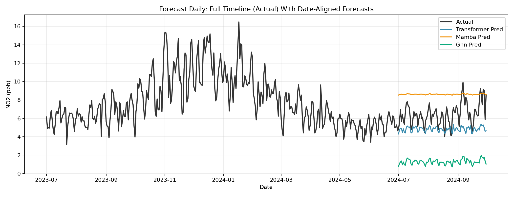
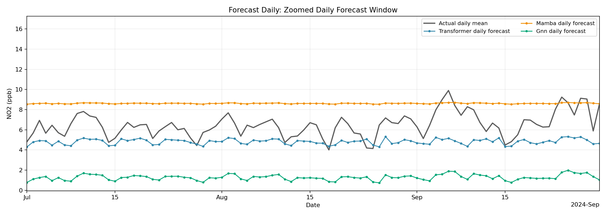
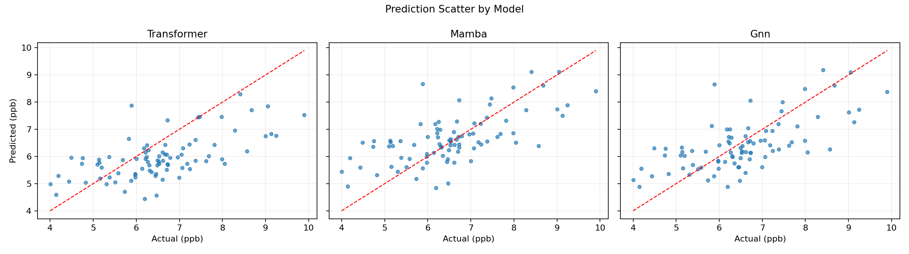
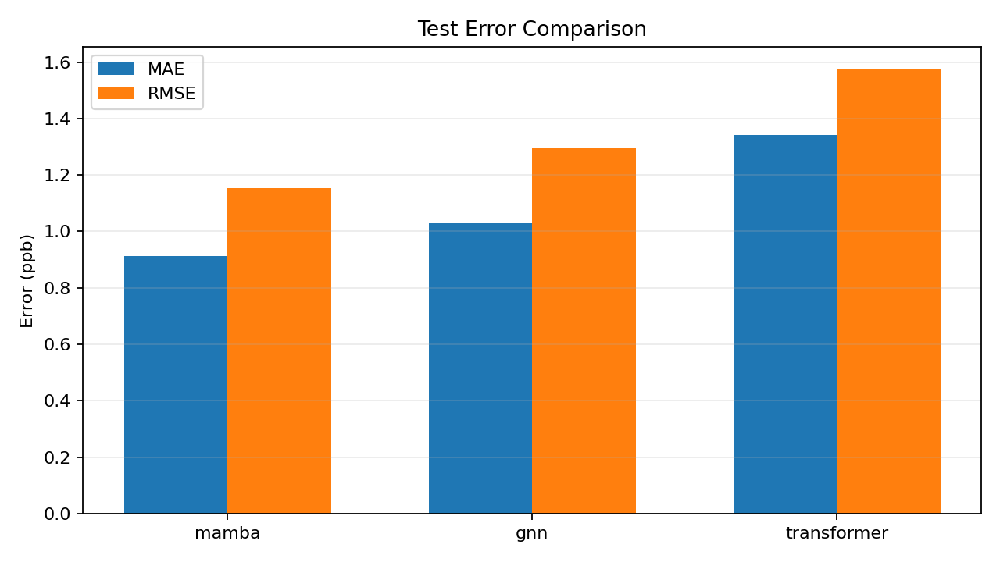

# Forecast Daily Results Guide

This folder stores outputs from daily univariate NO2 forecasting experiments
for three models:
- Transformer
- Mamba-like (GRU stand-in)
- GNN-style temporal model

## Training/Testing Methodology

All results in this folder were produced by running:

```bash
python forecast_daily/generate_results.py --epochs 50 --batch-size 32 --lr 1e-3 --train-end auto
```

Methodology pipeline:
1. Load hourly AirNow NO2 data from NetCDF files.
2. Aggregate to one daily mean series (site-mean hourly values resampled to daily means).
3. Build direct one-step daily supervision using lagged daily windows:
   - input window K = 7 past daily rows
   - target horizon H = 1 day ahead (direct t+1)
   - no recursive multi-day rollout
4. Add daily covariates per timestamp:
   - calendar features: month, day of week, day of year, weekend flag
   - cyclic encodings: sin/cos for month, day-of-week, and day-of-year
   - optional weather covariates when numeric columns are available
5. Split chronologically with `--train-end auto`:
   - train on first full year from the earliest date
   - test on later dates only
6. Fit scaling on train only:
   - NO2 target channel uses train-only min-max scaling
   - optional weather channels use train-only standardization
7. Train all models on identical train/test windows and evaluate on the same target dates.
8. Save predictions, metrics, checkpoints, and plots.

## Model results (this run)

From metrics.csv:

| Model | Epochs | Test MAE (ppb) | Test RMSE (ppb) |
|---|---:|---:|---:|
| GNN | 50 | 0.745 | 0.930 |
| Mamba | 50 | 0.720 | 0.934 |
| Transformer | 50 | 0.919 | 1.118 |

Quick takeaways:
- GNN has the best RMSE (slightly fewer large misses).
- Mamba has the best MAE (best typical absolute error).
- Transformer is weaker than the other two in this specific run.

## Graphs and how to interpret them

### 1) Time-series comparison



What this plot is:
- Black line: actual daily NO2 across the full available timeline.
- Colored lines: each model prediction on target dates only (NaN on non-target dates).

How to interpret:
- Better models follow the black line shape, peaks, and dips.
- If peaks are shifted right, the model has lag.
- If peaks are too low/high, the model under/overestimates amplitude.

What to look for in this run:
- Mamba and GNN generally track observed changes more closely than Transformer.

### 1b) Daily time-series diagnostic



What this plot is:
- Gray line: actual daily mean NO2 across the full timeline.
- Colored markers/lines: each model's daily forecast values on target dates only.

How to interpret:
- Forecast points must align to the target date, not the last input date.
- No forecast values should appear before the test target window.
- Any visible right-shift or left-shift against daily dates indicates an alignment bug.

Note:
- The filename `hourly_timeseries_with_daily_forecasts.png` is a legacy artifact name; the current figure is daily-timeline based.

### 2) Scatter (actual vs predicted)



What this plot is:
- One panel per model.
- X-axis: actual NO2.
- Y-axis: predicted NO2.
- Red dashed line: perfect prediction (y = x).

How to interpret:
- Points near the red line indicate accurate predictions.
- Wide spread means higher error variance.
- Systematic points below the line at high actual values indicate peak underprediction.

What to look for in this run:
- GNN and Mamba point clouds are tighter than Transformer overall.

### 3) Metrics bar chart



What this plot is:
- Side-by-side MAE and RMSE bars for each model.

How to interpret:
- Lower MAE = better average day-to-day accuracy.
- Lower RMSE = fewer or smaller large errors.
- If RMSE is much larger than MAE, large outliers are likely present.

What to look for in this run:
- Mamba leads on MAE.
- GNN leads on RMSE.
- Transformer trails both error metrics.

## Key output files

- airnow_no2_daily_mean.csv: Daily series used for training/testing.
- predictions_transformer.csv, predictions_mamba.csv, predictions_gnn.csv: test predictions with dates and actuals.
- metrics.csv and metrics.json: summary metrics and ranking.
- history_*.json: per-epoch train/test curves.
- checkpoints/*.pt: trained model weights.
- plots/timeseries_all_models.png: full-timeline daily actual line with date-aligned prediction overlays.
- plots/hourly_timeseries_with_daily_forecasts.png: daily-line diagnostic with target-date forecast markers.
- plots/scatter_all_models.png and plots/metrics_bar.png: accuracy diagnostics.

## Re-running experiments

Default results folder:

```bash
python forecast_daily/generate_results.py --epochs 50
```

Longer run in a separate folder (recommended):

```bash
python forecast_daily/generate_results.py --epochs 200 --results-dir results_longrun
```
